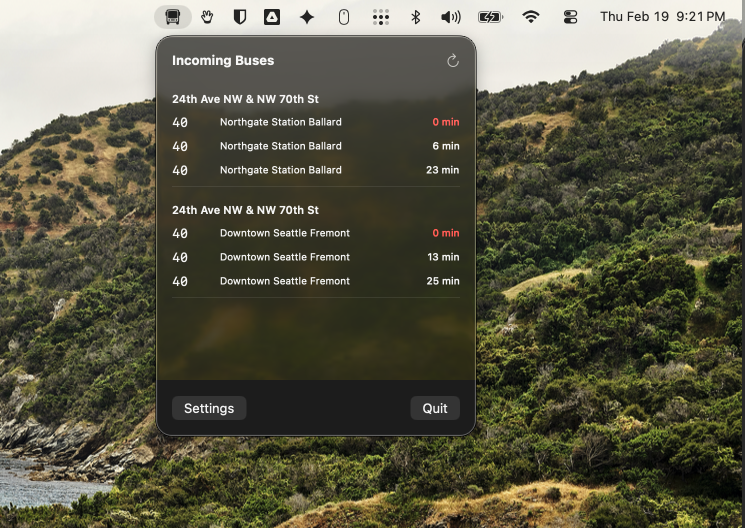

# oba-macos
A native macOS menu bar application for tracking bus arrivals using the OneBusAway API.

## Overview
This app lives in your Mac's menu bar and provides quick access to incoming buses for your saved stops. It is built natively using SwiftUI and modern macOS APIs.



## Features
- **Live Arrivals**: See real-time predicted and scheduled bus arrivals from the OneBusAway network.
- **Location-Based**: Uses your computer's location to find nearby bus stops automatically.
- **Customizable**: Select specific routes from your favorite stops to filter out buses you don't take.
- **Auto-Refresh**: Arrival times update automatically every 30 seconds.

## Setup
1. Clone the repository and open `oba-macos.xcodeproj` in Xcode.
2. Build and run the project.
3. Upon first launch, the Settings window will open. Click the **Settings** button in the menu bar popover if it does not.
4. Input your OneBusAway API Key (and optionally your server URL if you use a non-Puget Sound region).
5. Grant location permissions, find nearby stops, and click the star icon to save specific stops and routes.

## Building a Release `.app`

### Via Xcode (recommended)
1. Select **My Mac** as the run destination in the Xcode toolbar.
2. Choose **Product → Archive**. Xcode builds the app in Release configuration.
3. When the **Organizer** opens, click **Distribute App → Copy App → Export**.
4. Move the exported `.app` to `/Applications`.

### Via command line
```bash
xcodebuild \
  -project oba-macos.xcodeproj \
  -scheme oba-macos \
  -configuration Release \
  -archivePath build/oba-macos.xcarchive \
  archive
```

The `.app` can then be found inside the archive at:
```
build/oba-macos.xcarchive/Products/Applications/oba-macos.app
```

### Gatekeeper note
If macOS blocks the app on first launch (because it is not notarized), right-click the `.app` → **Open** → **Open** to bypass Gatekeeper once. Alternatively:
```bash
xattr -cr /path/to/oba-macos.app
```

## Technologies
- Swift 5+
- SwiftUI (`MenuBarExtra`, `Window`)
- OneBusAway REST API
- CoreLocation for nearby stops
